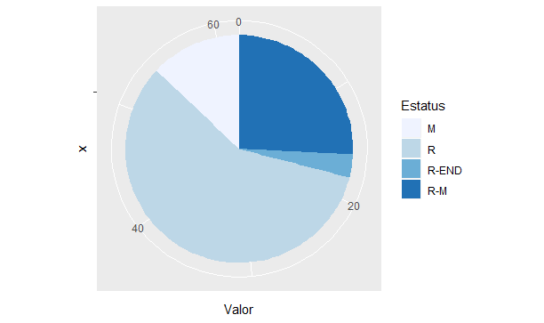
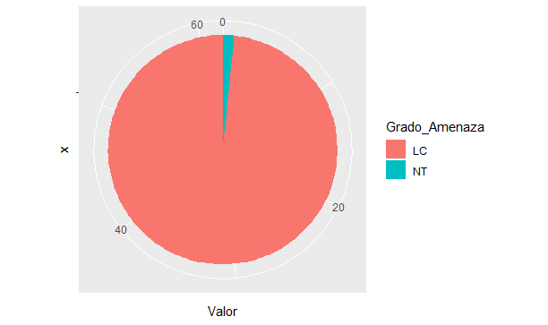

\
<p align="justify">
En el cuadro 1 se observa el total de las especies observadas en la gira a Coris de Cartago, 62 especies. También, se muestra el grado de amenaza de las poblaciones de cada especie (IUCN, 2019) y el estatus de las especies en Costa Rica, según la Lista Oficial de la Asociación Ornitologica Costaricense (2018).  
</p>
\
<p align= "justify">
**Cuadro 1.** Lista de las especies de aves observadas en Coris, Cartago.
</p>
\
<p align="center">
```{r results = "asis", echo = FALSE}
library(xtable)
cuadro<-read.csv("C:/Users/danma/Documents/R/EcologiaAVES/InformeCoris/AvesCoris.csv")
print(xtable::xtable(cuadro, caption=""),
      type="html", html.table.attributes = "border=0")
```
\
Fuente: Asociación Ornitológica Costarricense (2018); IUCN (2019).
</p>
\
<p align="justify">
En la figura 3 se observa un gráfico pastel donde se muestra información sobre el estatus de la especie en Costa Rica, según la Lista oficial de la Asociación Ornitologica Costaricense (2018). Donde del total de especies 62 especies: 8 se clasifican como  "Migratorias" (M), 36 corresponden a la clasificación "Residentes" (R), "Residentes-Endémicas" (R-END) abarcó 2 especies del total y 16 especies son "Residentes-Migratorias" (R-M).
</p>
\
<p align="center">
{width=600px}
\
**Figura 3.** Gráfico Pastel para el estatus de las especies observadas en la gira a Coris.
Fuente: Asociación Ornitológica Costarricense (2018).
</p>
\
En la figura 4 se muestra un gráfico pastel donde se comtempla el grado de amenaza de las especies observadas, de acuerdo con la IUCN. Del total de las especies observadas solamente se encontraron dos clasificaciones con respecto al grado de amenaza, correspondientes a: "Menor preocupación" (LC) donde se clasificaron 61 del total de las especies y "Casi amenazada" (NT).     
\
<p align="center">
{width=600px}
</p>
\
<p align="justify">
**Figura 4.** Gráfico para el grado de amenaza para las aves apreciadas en la gira a Coris.
Fuente: IUCN (2019).
</p>

