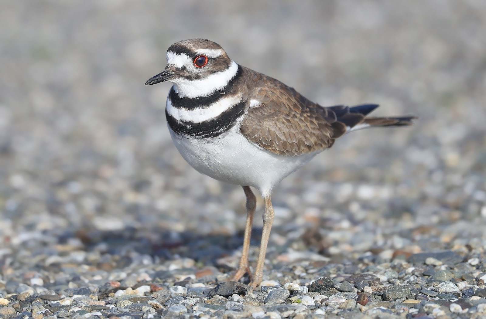
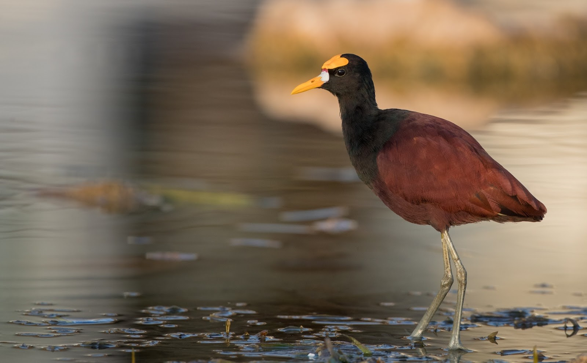

\

##*Charadrius vociferus*##

\

Lo observamos en la orilla de un riachuelo, dentro de un pastizal. Se mostró tímido, y cuando la cercanía del grupo fue mucha, alzó vuelo. El comportamiento y el hábitat anterior es respaldado por el libro de Stiles & Skutch (2007); donde también se expresa que esta especie se alimenta de renacuajos, insectos, lombrices y anfípodos, por lo que es posible que el individuo se encontrara en el sitio, donde se observó, buscando alimento. 

\

{width=600px}
\
**Figura 5.** Fotografía de Charadrius vociferus; tomada por Matt Davis, 2019. 

\

##*Jacana spinosa*##

\

Lo observamos en lagunas y zonas pantanosas de Coris, especialmente en áreas con abundante vegetación acuática como lirios o gramíneas. Es una ave de vuelo lento, que cuando aterriza mantiene las alas extendidas encima de su dorso; al caminar lo hace dando saltos pequeños sobre la vegetación mientras picotea velozmente en busca de insectos acuáticos, peces, caracoles o semillas (Stiles & Skutch, 2007).

\

{width=600px}
\
**Figura 6.** Fotografía de Jacana spinosa; tomada por Ian Davies, 2017.

\

**Referencias bibliográficas**
\

Garrigues, Richard., P. Camacho-Varela, M. Montoya, P. O’Donnell, O. Ramírez-Alán, J. Zook. 2018. Lista Oficial de las Aves de Costa Rica – Actualización 2018. Comité de Especies Raras y Registros Ornitológicos de Costa Rica (Comité Científico), Asociación Ornitológica de Costa Rica. Zeledonia 22:2. San José, Costa Rica. (Versión Online).

\

IUCN 2019. The IUCN Red List of Threatened Species. Version 2019-1. <https://www.iucnredlist.org>.

\

Municipalidad de Cartago. (2012). Plan regulador del Cantón Central de Cartago. Recuperado de: http://www.pgrweb.go.cr/DOCS/NORMAS/1/VIGENTE/RM/2010-2019/2010-2014/2012/120A7/EA85F.HTML

\

Peraza, J. C. (2015). Análisis de vulnerabilidad de las comunidades de Coris y Tablón, Provincia de Cartago, Costa Rica. Ciencias Espaciales, 8(1), 231-259.

\

Stiller, G. & A. Skutch. (2007). Guía de Aves de Costa Rica. Instituto Nacional de Biodiversidad, INBio, Heredia, Costa Rica.

