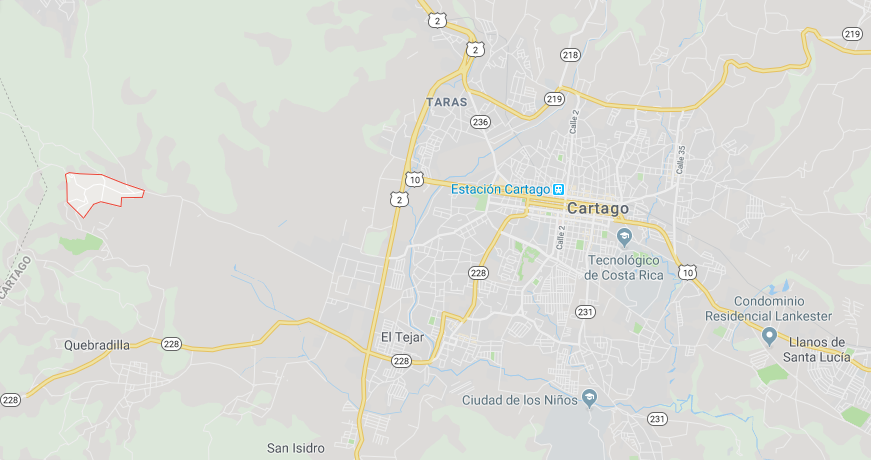

\

Autores: Daniela Marín Ramírez & Joselyn Miranda Gonzaléz

\
\

##**Sitio de Observación de Aves**##

\

Coris (9.8666667 N y -83.9833333 O), es un poblado ubicado en el distrito de Quebradilla, del cantón central de Cartago, Costa Rica y se encuentra a 1400 m.s.n.m. Estas tierras son de origen tectónico y erosivo, con formaciones de rocas viejas en los valles (Peraza, 2015). En la zona se llevan a cabo actividades socioeconómicas relacionadas con la agricultura y la ganadería (Municipalidad de Cartago, 2012). El área donde se realizó el avistamiento de aves, cuenta con formaciones de lagunas o partes empantanadas en los potreros, provocados por el uso de ríos para el riego de las tierras.

{width=600px}
\
**Figura 1.** Ubicación del poblado de Coris en Cartago.

